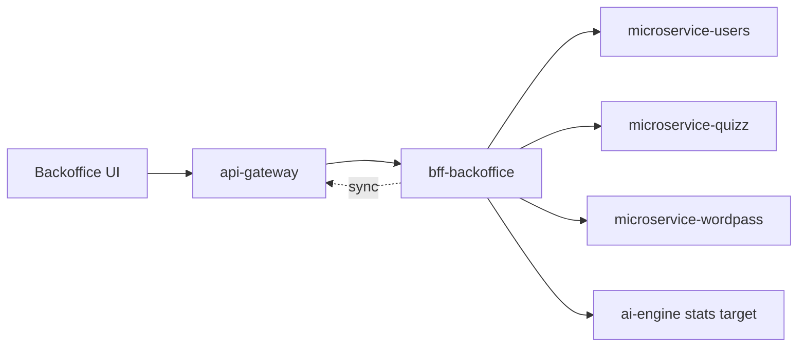

# bff-backoffice

Backend-for-Frontend service for AxiomNode backoffice operations.

## Architectural role

`bff-backoffice` is the operational control plane for the backoffice channel. It shields the UI from domain-service details and now also owns part of the runtime routing state used for diagnostics and service targeting.

## Runtime context

## Responsibilities

- Expose admin-focused APIs for monitoring and control workflows.
- Aggregate and normalize data from internal services.
- Keep backoffice UI decoupled from domain-service internals.
- Persist shared runtime routing metadata required by operations.
- Expose shared ai-engine preset management for all backoffice users.

## Repository structure

- `src/`: Fastify + TypeScript implementation.
- `docs/`: architecture, guides, and operations docs.
- `.github/workflows/ci.yml`: CI + deployment dispatch trigger.

## Primary operational use cases

- inspect service health and operational summaries
- inspect and override upstream service targets during controlled operations
- manage reusable ai-engine destination presets shared across browsers
- synchronize effective ai-engine runtime changes toward `api-gateway`

## Local development

1. `cd src`
2. `cp .env.example .env`
3. `npm install`
4. `npm run dev`

## Main routes

- `GET /health`
- `GET /v1/backoffice/users/leaderboard`
- `GET /v1/backoffice/monitor/stats`
- `GET /v1/backoffice/service-targets`
- `PUT /v1/backoffice/service-targets/:service`
- `DELETE /v1/backoffice/service-targets/:service`
- `GET /v1/backoffice/ai-engine/target`
- `PUT /v1/backoffice/ai-engine/target`
- `DELETE /v1/backoffice/ai-engine/target`
- `GET /v1/backoffice/ai-engine/presets`
- `POST /v1/backoffice/ai-engine/presets`
- `PUT /v1/backoffice/ai-engine/presets/:presetId`
- `DELETE /v1/backoffice/ai-engine/presets/:presetId`

## Runtime state model

- Upstream service overrides are stored in `BACKOFFICE_ROUTING_STATE_FILE`.
- Shared ai-engine destination presets are stored in the same persisted state file.
- This state is shared by all users connected to the same deployed BFF instance.
- The BFF is therefore not just a read API; it is also a small runtime operations state holder.

## CI/CD workflow behavior

- `ci.yml`
	- Trigger: push (`main`, `develop`), pull request, manual dispatch.
	- Job `build-test-lint`: checks out `shared-sdk-client` with `CROSS_REPO_READ_TOKEN`, blocks tracked `src/node_modules` / `src/dist`, then runs install, build, test, lint, and production `npm audit --omit=dev --audit-level=high`.
	- Job `trigger-platform-infra-build`:
		- Runs on push to `main`.
		- Waits for `build-test-lint` to succeed before dispatching `platform-infra`.
		- Dispatches `platform-infra/.github/workflows/build-push.yaml` with `service=bff-backoffice`.
		- Requires `PLATFORM_INFRA_DISPATCH_TOKEN` in this repo.

## Deployment automation chain

Push to `main` triggers image rebuild in `platform-infra`, then automatic Kubernetes deployment to `stg` if service validation and central packaging both succeed.

## Internal dependencies

- `USERS_SERVICE_URL`
- `QUIZZ_SERVICE_URL`
- `WORDPASS_SERVICE_URL`
- `AI_ENGINE_STATS_URL`

## Routing and security notes

- Generic service-target overrides remain subject to `ALLOWED_ROUTING_TARGET_HOSTS`.
- The dedicated ai-engine target route stays intentionally more permissive so operations can move the engine to an external reachable host when required.
- `API_GATEWAY_ADMIN_TOKEN` can protect the gateway synchronization path.

## Runtime routing overrides

- The BFF can override upstream base URLs at runtime for `api-gateway`, `bff-mobile`, `microservice-users`, `microservice-quiz`, `microservice-wordpass`, `ai-engine-stats`, and `ai-engine-api`.
- Overrides are persisted in `BACKOFFICE_ROUTING_STATE_FILE` and survive BFF restarts.
- Legacy ai-engine target routes remain available and now do two things in one step: update the BFF local diagnostics target and synchronize the live ai-engine target stored by `api-gateway`.
- `ALLOWED_ROUTING_TARGET_HOSTS` can restrict overrides to explicit hosts, wildcard suffixes like `*.amksandbox.cloud`, and IPv4 CIDR ranges such as `192.168.0.0/16`.
- The dedicated ai-engine target route is exempt from that allowlist so backoffice admins can move ai-engine to any reachable host without redeploying the cluster.
- `API_GATEWAY_ADMIN_TOKEN` is optional hardening for the internal gateway sync route; when set, the BFF sends it as a bearer token while propagating ai-engine target changes.

## Related documents

- `docs/architecture/`
- `docs/operations/`
- `../docs/operations/runtime-routing-and-service-targeting.md`
