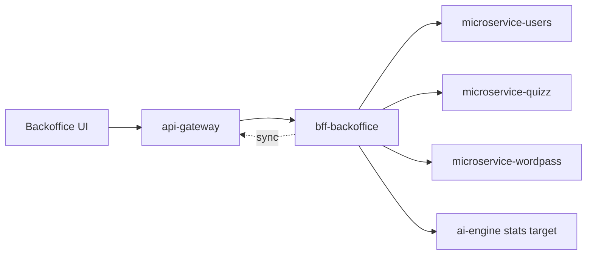

# bff-backoffice

Last updated: 2026-05-03.

Backend-for-Frontend service for AxiomNode backoffice operations.

## Responsibility

`bff-backoffice` is the operational control plane for the backoffice channel. It shields the UI from domain-service details and now also owns part of the runtime routing state used for diagnostics and service targeting.

## Runtime role

### Runtime context

### Main responsibilities

- Expose admin-focused APIs for monitoring and control workflows.
- Aggregate and normalize data from internal services.
- Keep backoffice UI decoupled from domain-service internals.
- Persist shared runtime routing metadata required by operations.
- Expose shared ai-engine preset management for all backoffice users.

## Runtime surface

### Control-plane role

`bff-backoffice` is more than a read-only BFF. It also acts as a narrow runtime control component for operator workflows.

Concrete responsibilities beyond standard orchestration:

- persist service-target overrides shared across operators
- persist reusable ai-engine destination presets
- synchronize ai-engine target changes toward `api-gateway`
- expose effective target state back to the UI

Operator-facing diagnostics semantics and runtime-control behavior are documented in the capability dossiers so this README can stay focused on repository ownership.

## Local setup

### Repository structure

- `src/`: Fastify + TypeScript implementation.
- `docs/`: architecture, guides, and operations docs.
- `.github/workflows/ci.yml`: CI + deployment dispatch trigger.

### Primary operational use cases

- inspect service health and operational summaries
- manage shared routing overrides and ai-engine presets
- synchronize effective ai-engine runtime changes toward `api-gateway`

### Local development

1. `cd src`
2. `cp .env.example .env`
3. `npm install`
4. `npm run dev`

### Route note

This service owns backoffice-facing diagnostics, target-management, and ai-engine preset routes. Use `docs/architecture/README.md` and the operations capability dossiers for the concrete inventory.

### Runtime state model

- Upstream service overrides are stored in `BACKOFFICE_ROUTING_STATE_FILE`.
- Shared ai-engine destination presets are stored in the same persisted state file.
- This state is shared by all users connected to the same deployed BFF instance.
- The BFF is therefore not just a read API; it is also a small runtime operations state holder.

## Dependencies and contracts

### Dependency model

Primary downstream dependencies:

- `microservice-users`
- `microservice-quizz`
- `microservice-wordpass`
- `ai-engine-stats`
- `api-gateway` administrative synchronization path

## Deployment and operations notes

### CI/CD and rollout note

CI, image publication, and staging rollout behavior are documented in `docs/operations/README.md` and `../docs/operations/cicd-workflow-map.md`.

### Internal dependencies

- `USERS_SERVICE_URL`
- `QUIZZ_SERVICE_URL`
- `WORDPASS_SERVICE_URL`
- `AI_ENGINE_STATS_URL`

### Routing and security notes

- Generic service-target overrides remain subject to `ALLOWED_ROUTING_TARGET_HOSTS`.
- The dedicated ai-engine target route stays intentionally more permissive so operations can move the engine to an external reachable host when required.
- `API_GATEWAY_ADMIN_TOKEN` can protect the gateway synchronization path.

### Runtime routing overrides

Overrides and presets are persisted in `BACKOFFICE_ROUTING_STATE_FILE` and can survive BFF restarts. Detailed allowlist and synchronization behavior is documented in the routing-control and diagnostics capability docs.

## Documentation

- `docs/README.md`
- `docs/architecture/README.md`
- `docs/guides/README.md`
- `docs/operations/README.md`

### Failure boundaries

- routing-state persistence failure
- gateway synchronization failure that leaves local and effective targets diverged
- downstream diagnostics failure while control routes remain available
- allowlist misconfiguration that blocks intended retargeting

## References

- `docs/architecture/`
- `docs/operations/`
- `../docs/guides/capabilities/operations/backoffice-operational-diagnostics.md`
- `../docs/guides/capabilities/operations/runtime-routing-control.md`
- `../docs/operations/runtime-routing-and-service-targeting.md`
